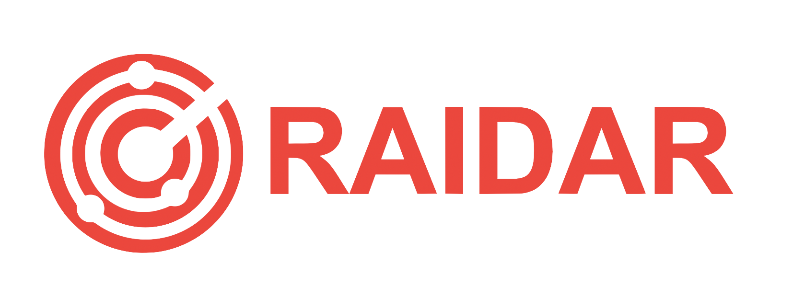

# Raidar Frontend

<p align="middle">
   <a href="https://near.org/" target="blank"></a>
</p>
<p>
    &nbsp;
    &nbsp;
</p>

<p align="middle">
   <a href="" target="blank"></a>
</p>

Raidar is a platform that allows artists and users buy and sell rights to music in a digital collectibles (NFTs) format.

## Getting Started

Install the dependencies:

```bash
npm install
```

Then, run the development server:

```bash
npm run dev
```

Open [http://localhost:3000](http://localhost:3000) with your browser to see the result.

## API Code Generation

API hooks, functions and types are genereated from the API Swagger files. APIs are generated in `./services/api/raidar` folder.

```bash
npm run api:codegen:client
```

## Project URLs

[Production](https://app.raidar.us/)
